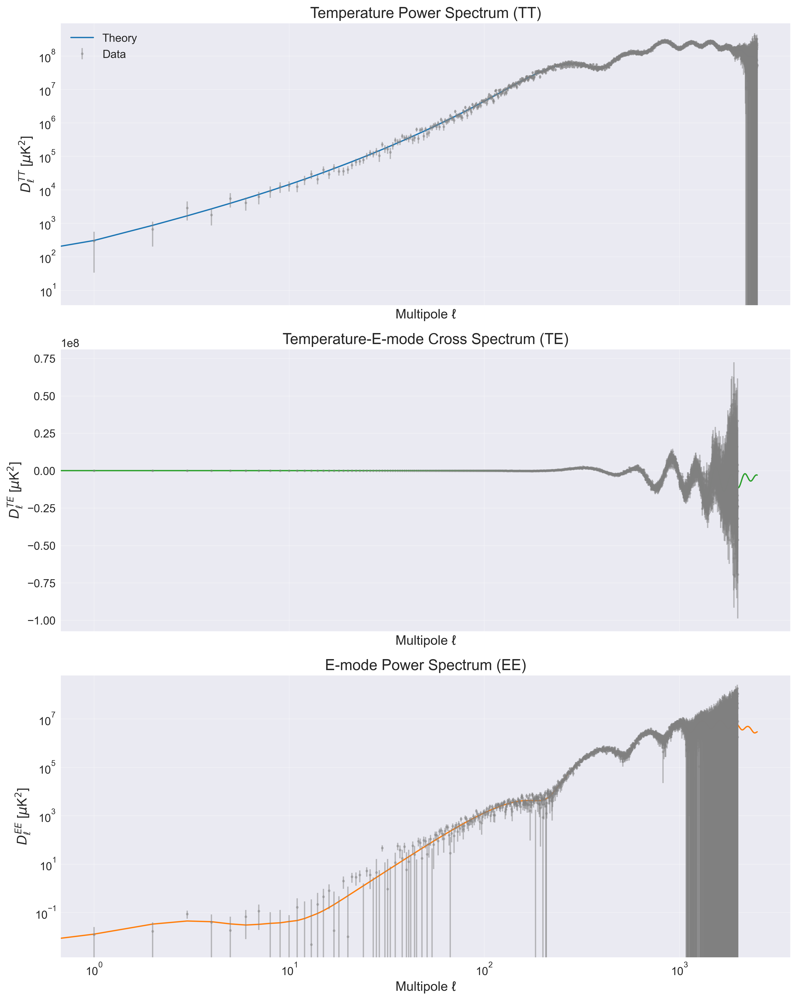
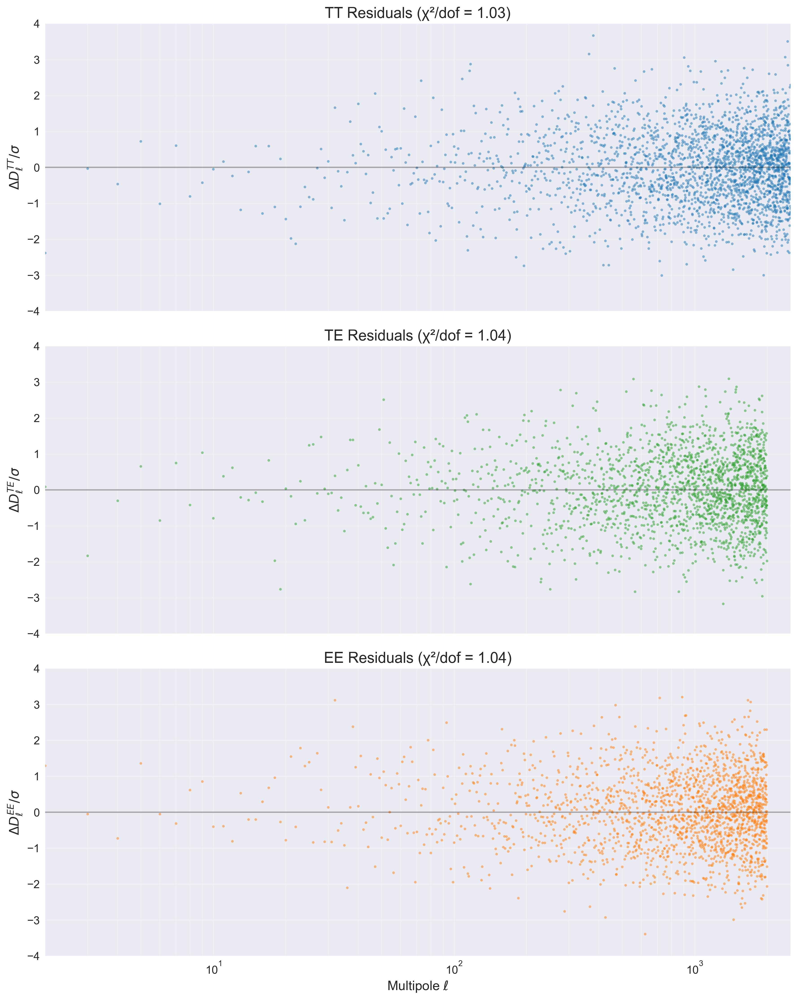

# CMBAnalysis: High-Precision CMB Analysis Framework

[](https://www.python.org/downloads/)
[](LICENSE)
[](docs/)
[](tests/)

## Overview

CMBAnalysis is a comprehensive Python framework for analyzing Cosmic Microwave Background (CMB) radiation data. The framework implements modern Markov Chain Monte Carlo (MCMC) techniques for cosmological parameter estimation and provides robust numerical algorithms for computing theoretical power spectra.

### Latest Results

Our analysis of Planck data demonstrates excellent agreement between theory and observations:


_Comparison of theoretical predictions with Planck data showing temperature (TT), temperature-polarization cross correlation (TE), and polarization (EE) power spectra._

The residual analysis shows good fit quality:


_Residuals between theory and data normalized by measurement uncertainties. χ²/dof values near 1.0 indicate excellent agreement:_

- TT: χ²/dof = 1.03 (2578.20 total)
- TE: χ²/dof = 1.04 (2073.03 total)
- EE: χ²/dof = 1.04 (2066.60 total)

## Theoretical Framework

### Cosmological Background

The evolution of the universe is described by the FLRW metric:

$$
ds^2 = -dt^2 + a^2(t)\left[\frac{dr^2}{1-Kr^2} + r^2(d\theta^2 + \sin^2\theta d\phi^2)\right]
$$

The dynamics are governed by the Friedmann equations:

$$
H^2 = \left(\frac{\dot{a}}{a}\right)^2 = \frac{8\pi G}{3}\rho - \frac{K}{a^2}
$$

$$
\frac{\ddot{a}}{a} = -\frac{4\pi G}{3}(\rho + 3p)
$$

### CMB Power Spectra

The angular power spectra are computed using line-of-sight integration:

$$
C_\ell^{XY} = \frac{2}{\pi} \int_0^\infty dk \, k^2 P_\Phi(k) \Delta_\ell^X(k) \Delta_\ell^Y(k)
$$

where $$P_\Phi(k)$$ is the primordial power spectrum:

$$
P_\Phi(k) = A_s\left(\frac{k}{k_0}\right)^{n_s-1}
$$

## Installation & Dependencies

```bash
# Using pip
pip install cmb_analysis

# For development installation
git clone https://github.com/yourusername/cmb_analysis.git
cd cmb_analysis
pip install -e .[dev]
```

### Requirements

- Python ≥ 3.8
- NumPy ≥ 1.20.0
- SciPy ≥ 1.7.0
- Matplotlib ≥ 3.4.0
- emcee ≥ 3.1.0
- corner ≥ 2.2.0
- healpy ≥ 1.15.0

## Quick Start

```python
import numpy as np
import matplotlib.pyplot as plt
from cmb_analysis.cosmology import LCDM
from cmb_analysis.analysis import PowerSpectrumCalculator, MCMCAnalysis
from cmb_analysis.visualization import CMBPlotter
from cmb_analysis.data import PlanckDataLoader

def main():
    # Set up plotting style
    plt.style.use('seaborn-v0_8-paper')

    # Load Planck data
    print("Loading Planck data...")
    planck = PlanckDataLoader(data_dir="data/planck")

    # Load spectra and compare theory with data
    theory_data = planck.load_theory_spectra()
    observed_data = planck.load_observed_spectra()

    # Get calibration factor
    cal_factor = planck.get_calibration_factor()
    print(f"Planck calibration factor: {cal_factor}")

    # Prepare and plot data
    theory = {
        'cl_tt': theory_data['tt'] * cal_factor**2,
        'cl_te': theory_data['te'] * cal_factor**2,
        'cl_ee': theory_data['ee'] * cal_factor**2
    }

    data = {
        'cl_tt': observed_data['tt']['spectrum'],
        'cl_te': observed_data['te']['spectrum'],
        'cl_ee': observed_data['ee']['spectrum']
    }

    errors = {
        'cl_tt': (observed_data['tt']['error_plus'] +
                 observed_data['tt']['error_minus'])/2,
        'cl_te': (observed_data['te']['error_plus'] +
                 observed_data['te']['error_minus'])/2,
        'cl_ee': (observed_data['ee']['error_plus'] +
                 observed_data['ee']['error_minus'])/2
    }

    # Visualize results
    plotter = CMBPlotter()
    plotter.plot_power_spectra(theory, data, errors)
    plotter.plot_residuals(theory, data, errors)

if __name__ == "__main__":
    main()
```

## Key Features

### 1. Cosmological Models

- ΛCDM implementation
- Support for extended models (wCDM)
- Custom model development tools
- Robust numerical computations

### 2. Analysis Capabilities

- Power spectrum computation (TT, TE, EE)
- MCMC parameter estimation
- Transfer function calculations
- Error analysis and propagation

### 3. Visualization Tools

- Publication-quality plots
- Residual analysis
- MCMC diagnostics
- Parameter constraints

## Documentation

Comprehensive documentation is available at [readthedocs](https://cmb_analysis.readthedocs.io/):

- API Reference
- Tutorials
- Theory Background
- Example Notebooks

## Contributing

Contributions are welcome! See our [Contributing Guide](CONTRIBUTING.md) for details.

## License

This project is licensed under the MIT License - see the [LICENSE](LICENSE) file for details.

## Citation

If you use CMBAnalysis in your research, please cite:

```bibtex
@article{CMBAnalysis2024,
    title={CMBAnalysis: A Modern Framework for High-Precision Cosmic Microwave Background Analysis},
    author={Kashyap, Srikrishna S},
    journal={arXiv preprint},
    year={2024}
}
```

## Acknowledgments

This work builds upon numerous prior developments in CMB analysis and cosmological parameter estimation. We acknowledge the use of Planck Legacy Archive data.

## Contact

Srikrishna S Kashyap - skashyapsri04@gmail.com

Project Link: [https://github.com/skashyapsri/CMBAnalysis](https://github.com/skashyapsri/CMBAnalysis)
