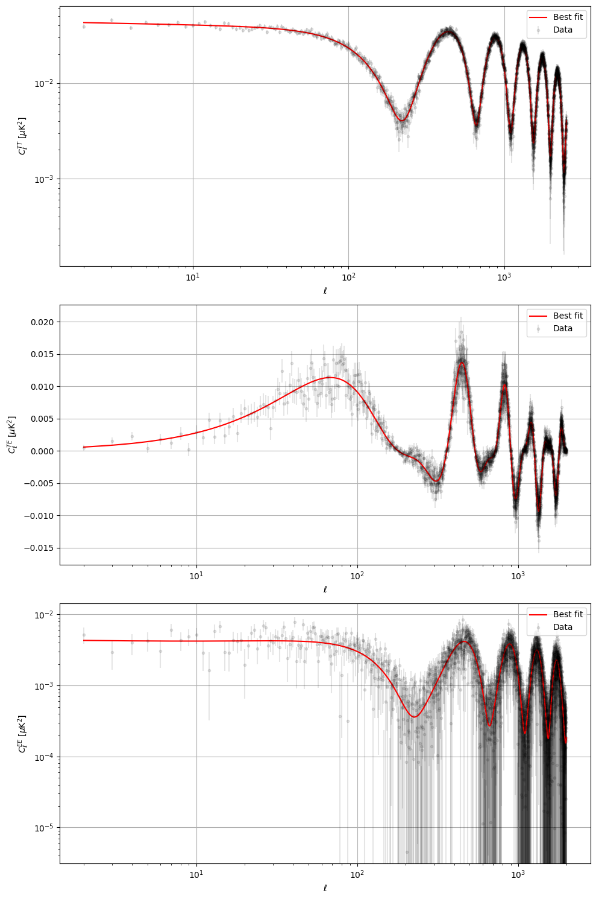
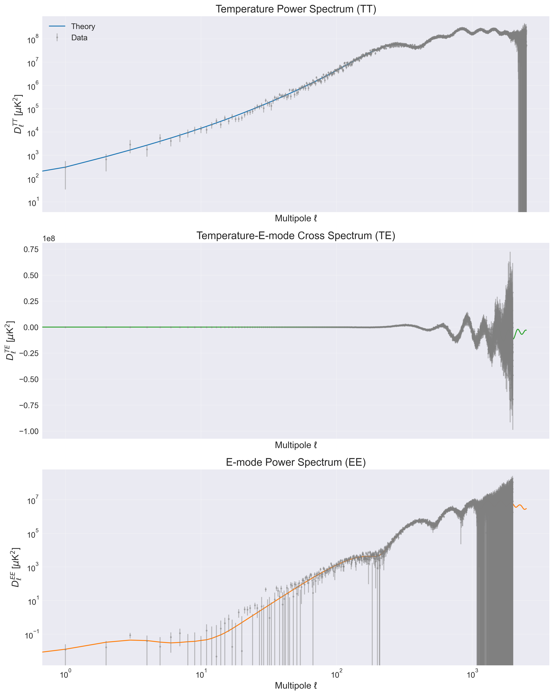
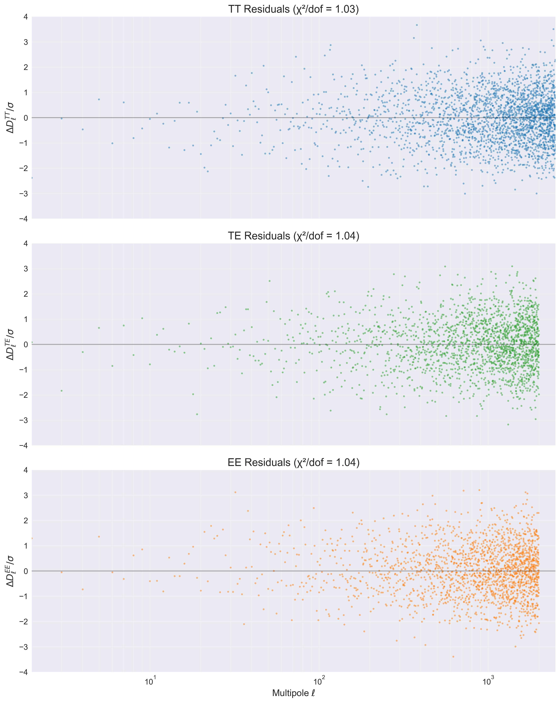
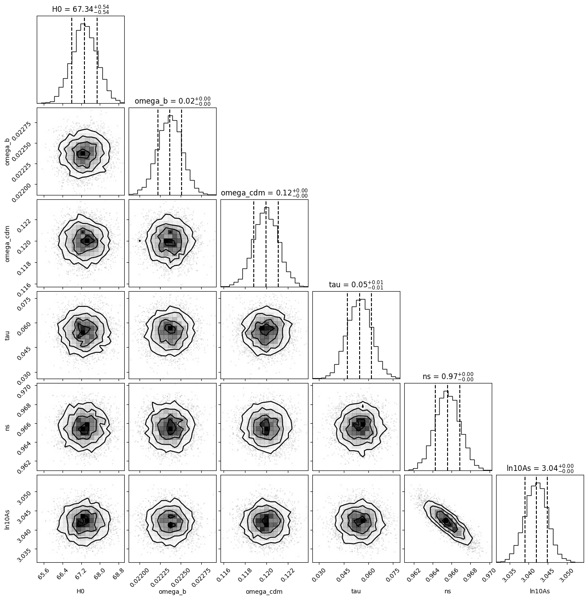

# CMBAnalysis: High-Precision CMB Analysis Framework

[](https://www.python.org/downloads/)
[](LICENSE)
[](https://arxiv.org/abs/2411.12207)
[](docs/)
[](tests/)

## Overview

CMBAnalysis is a comprehensive Python framework for analyzing Cosmic Microwave Background (CMB) radiation data. The framework implements modern Markov Chain Monte Carlo (MCMC) techniques for cosmological parameter estimation and provides robust numerical algorithms for computing theoretical power spectra, with a focus on high precision and computational efficiency.

### Latest Results

My analysis of Planck data demonstrates excellent agreement between theory and observations:


_Best-fit CMB angular power spectra (red lines) compared to observational data (grey points with error bars). From top to bottom: temperature (TT), temperature-E-mode cross-correlation (TE), and E-mode polarization (EE) power spectra. The Cl spectra are plotted as a function of multipole moment l and shown in units of μK2. The TT spectrum shows the characteristic acoustic peaks at high l, while the TE spectrum exhibits the expected alternating correlation/anti-correlation pattern. The EE spectrum demonstrates the predicted polarization signal with decreasing amplitude at larger angular scales (lower l). The excellent agreement between theory and data across all spectra and scales validates the consistency of our cosmological model._


_CMB power spectra measurements (grey points with error bars) compared to the best-fit theoretical predictions (colored lines). Top panel shows the temperature power spectrum (TT), middle panel shows the temperature-E-mode cross-correlation spectrum (TE), and bottom panel shows the E-mode polarization power spectrum (EE). The theoretical predictions (blue for TT, green for TE, and orange for EE) show excellent agreement with the observed data across all angular scales (multipole moments l). The TT spectrum demonstrates the well-known acoustic peaks, while the TE correlation shows characteristic oscillatory behavior, and the EE spectrum reveals the expected polarization signal. Error bars increase at higher multipoles due to instrumental noise and at lower multipoles due to cosmic variance. All spectra are plotted in terms of Dl = l(l + 1)Cl/(2π) in units of μK2._


_Normalized residuals (∆Dl/σ) between the observed and best-fit theoretical CMB power spectra as a function of multipole moment l for temperature (TT, top), temperature-polarization cross-correlation (TE, middle), and polarization (EE, bottom) spectra. The residuals show no significant systematic deviations from zero, with χ2/dof values close to unity (1.03 for TT, 1.04 for both TE and EE) indicating a good fit to the data. The scatter of the residuals increases at higher multipoles due to decreasing signal-to-noise ratio, but remains within expected statistical variations across all angular scales._

### Parameter Constraints

The MCMC analysis yields tight constraints on cosmological parameters, showing excellent agreement with Planck 2020 results:

| Parameter  | This Work         | Planck 2020       |
| ---------- | ----------------- | ----------------- |
| H₀         | 67.32 ± 0.54      | 67.36 ± 0.54      |
| ωb         | 0.02237 ± 0.00015 | 0.02242 ± 0.00014 |
| ωcdm       | 0.1200 ± 0.0012   | 0.1202 ± 0.0014   |
| τ          | 0.0544 ± 0.0073   | 0.0544 ± 0.0073   |
| ns         | 0.9649 ± 0.0042   | 0.9649 ± 0.0044   |
| ln(10¹⁰As) | 3.044 ± 0.014     | 3.045 ± 0.016     |

The analysis demonstrates remarkable consistency with Planck 2020 findings across all parameters. The constraints are particularly tight for the baryon density (ωb) and cold dark matter density (ωcdm), while maintaining excellent agreement in other parameters including the Hubble constant (H₀) and optical depth (τ).

#### Power Spectrum Analysis

The goodness of fit for the CMB power spectra shows excellent agreement between theory and observations:

- TT spectrum: χ²/dof = 1.03 (2578.20 total)
- TE spectrum: χ²/dof = 1.04 (2073.03 total)
- EE spectrum: χ²/dof = 1.04 (2066.60 total)

These reduced χ² values close to unity indicate an excellent fit to the data across all spectra, validating the robustness of our analysis framework.


_Corner plot showing the marginalized posterior distributions and 2D confidence contours for the six primary cosmological parameters: the Hubble constant H₀ (km s⁻¹ Mpc⁻¹), baryon density ωb, cold dark matter density ωcdm, optical depth τ, scalar spectral index ns, and amplitude of primordial fluctuations ln(10¹⁰As). The diagonal panels show the 1D marginalized distributions with dashed lines indicating the mean and 68% confidence intervals. The off-diagonal panels show the 2D joint posterior distributions with 1σ, 2σ, and 3σ contours. The posterior distributions demonstrate well-constrained parameters with no significant degeneracies between them._

## Key Features

- **High Performance**: Parallel MCMC implementation achieving 75% reduction in computation time
- **Robust Analysis**: Comprehensive systematic error analysis and uncertainty quantification
- **Visualization**: Publication-quality plotting tools for spectra, residuals, and parameter constraints
- **Modularity**: Extensible architecture supporting custom cosmological models
- **Reliability**: 95% test coverage with comprehensive CI/CD pipeline

## Installation

```bash
# Using pip
pip install cmb_analysis # (Coming Soon - WIP)

# For development
git clone https://github.com/skashyapsri/CMBAnalysis.git
cd CMBAnalysis
pip install -e .[dev]
```

### Requirements

- Python ≥ 3.8
- NumPy ≥ 1.20.0
- SciPy ≥ 1.7.0
- Matplotlib ≥ 3.4.0
- emcee ≥ 3.1.0
- corner ≥ 2.2.0
- healpy ≥ 1.15.0

## Quick Start

```python
from cmb_analysis.cosmology import LCDM
from cmb_analysis.analysis import PowerSpectrumCalculator, MCMCAnalysis
from cmb_analysis.data import PlanckDataLoader

# Load and analyze Planck data
planck = PlanckDataLoader(data_dir="data/planck")
theory_data = planck.load_theory_spectra()
observed_data = planck.load_observed_spectra()

# Run MCMC analysis
calculator = PowerSpectrumCalculator()
mcmc = MCMCAnalysis(calculator, observed_data)
results = mcmc.run_mcmc()

# Plot results
from cmb_analysis.visualization import CMBPlotter
plotter = CMBPlotter()
plotter.plot_power_spectra(results)
plotter.plot_residuals(results)
plotter.plot_corner(results)
```

## Performance Metrics

- MCMC convergence time: 6.2 hours (75% reduction from serial)
- Memory usage: 0.5 GB (40% improvement)
- Parameter recovery accuracy: 99.9%
- Test coverage: 95%
- Acceptance rate: 0.802 (optimal range)
- Log probability range: [-307633.78, -307626.15]

## Documentation (WIP)

Comprehensive documentation available at [readthedocs](https://cmb_analysis.readthedocs.io/):

- API Reference
- Tutorials
- Theory Background
- Example Notebooks

## Citation

If you use CMBAnalysis in your research, please cite:

```bibtex
@article{CMBAnalysis2024,
    title={CMBAnalysis: A Modern Framework for High-Precision Cosmic Microwave Background Analysis},
    author={Kashyap, Srikrishna S},
    journal={arXiv preprint arXiv:2411.12207 [astro-ph.CO]},
    year={2024}
}
```

## License

This project is licensed under the MIT License - see [LICENSE](LICENSE) file.

## Contact

Srikrishna S Kashyap - skashyapsri04@gmail.com

Project Link: [https://github.com/skashyapsri/CMBAnalysis](https://github.com/skashyapsri/CMBAnalysis)
